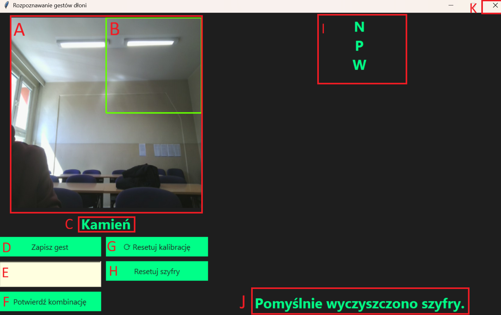

# Instrukcja obsługi

* A - Kamera
* B - Obszar w którym wychwytywane są gesty ręki
* C - Tekst który opisuje jaki gest jest obecnie pokazywany, obecnie obsługiwane gesty to: Kamień, papier, nożyce, wskazywanie, machanie. 
* D - Przycisk zapisujący obecny gest wskazywany przez **C**
* E - Pole tekstowe w którym można wpisać wiadomość do zaszyfrowania
* F - Przycisk który potwierdza kombinację gestów wskazywanych przez **I** i napis wpisany w **E**
* G - Przycisk kalibrujący kamerę na nowo
* H - Przycisk czyszczący zapisane szyfry
* I - Pole z obecnym szyfrem, reprezentowanym przez pierwsze litery gestów
* J - Pole informacyjne
* K - Przycisk zamykający okno

## Działanie programu
1. Po uruchomieniu, program automatycznie kalibruje kamerę po raz pierwszy (napis 'Kalibracja...' w polu **C**). Najlepiej aby tło było możliwie jednolite, dobrze oświetlone i koloru kontrastującego kolor skóry (szczególnie pole **B**).
2. Możemy zacząć używać programu. W polu **C** możemy zobaczyć aktualnie pokazywany gest. Używając pól obsługi (od **D** do **F**) możemy utworzyć szyfr, wpisać szyfrowaną wiadomość oraz zapisać je do bazy danych. Gdy podany szyfr jest już w bazie, to odczytamy jego zawartość.
3. W przypadku, gdy gesty nie są odczytywane prawidłowo lub chcemy zmienić pozycję, można użyć przycisku **G** do powtórnej kalibracji kamery.
4. Używając przycisku **H** możemy całkowicie wyczyścić bazę szyfrów.
5. Po zakończeniu pracy z programem możemy wyjść używając **K**. Uwaga: Baza danych nie jest zachowywana po wyjściu z programu.
