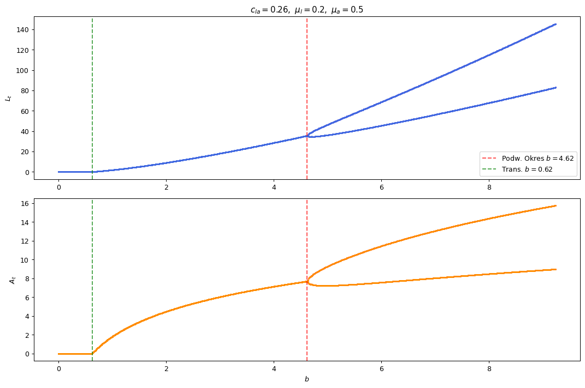

# Python Projects

A small collection of Python programs I wrote while learning the language. They
cover the fundamentals: object-oriented programming, custom data structures,
text processing and a simple web-scraping utility. Each folder is a
self-contained topic.

## Contents

### `oop` — Object-oriented programming
`classes.ipynb` demonstrates core OOP concepts:
- **`Osoba` (Person)** — validates a Polish *PESEL* national-ID number using its
  checksum and derives the birth date from it. Fields are guarded by properties
  with validation in the setters.
- **`Vector`** — a 3D vector built with operator overloading (`+`, `-`, scalar
  `*`, dot product, equality, indexing) plus length, cross product and the angle
  between two vectors.
- **`Fib`** — a Fibonacci iterator (`__iter__` / `__next__`).
- **`factorial`** — a function documented and tested with `doctest`.

### `data_structures`
`linked_list.ipynb` — from-scratch implementations of a singly **linked list**
(`append`, `pop`, `isEmpty`, string representation) and a simple directed
**graph** based on an adjacency set.

### `text_processing`
`file_spellcheck.ipynb` — a `Plik` ("File") class that reads a text file and
interactively corrects a common Polish spelling pattern (**uw → ów**), keeping a
list of exceptions.

### `web_scraping`
`ao3_status_checker.py` — a script using `requests` and `BeautifulSoup` that
fetches a web page, extracts a status field and appends it to a timestamped log,
flagging when the value changes.

### `Dynamical Systems`
Numerical exploration of how simple nonlinear maps transition from stable
equilibria, through period-doubling, into chaos. The work combines fixed-point
analysis, iteration, root-finding and bifurcation diagrams, applied to the
classic logistic map and a discrete host–parasitoid ecological model.

**Tools:** Python · NumPy · SciPy (`fsolve`) · Matplotlib

See [`dynamical_systems.ipynb`](dynamical_systems.ipynb) for the full notebook
with code and explanations.

### `LPA model`
A discrete stage-structured model couples a larval stage `L` and an adult stage `A`:

$$L_{t+1} = b\,A_t, \qquad A_{t+1} = L_t (1-\mu_l)\,e^{-c_{la} A_t} + A_t(1-\mu_a).$$

As the reproduction rate `b` increases, the non-trivial equilibrium loses
stability when a Jacobian eigenvalue passes through −1: a **flip
(period-doubling) bifurcation**. Whether the resulting 2-cycle is stable
depends on the sign of the **first Lyapunov coefficient** `c`, computed here via
a normal-form (Kuznetsov) reduction using the second- and third-order
derivative tensors of the map.

The implementation ([`lpa_kuznetsov.py`](lpa_kuznetsov.py)) locates the flip
point with `brentq`, computes `c` numerically, and cross-checks it against a
closed-form analytical expression derived for this model. The two agree to
eight decimal places across every parameter set tested:

| `(c_la, μ_l, μ_a)` | flip `b` | `c` (numerical) | `c` (analytical) | Type |
|---|---|---|---|---|
| (0.40, 0.90, 0.70) | 16.49 | 0.05176471 | 0.05176471 | supercritical |
| (0.26, 0.20, 0.50) | 4.62  | 0.02628889 | 0.02628889 | supercritical |
| (0.10, 0.10, 0.20) | 662.44 | 0.00527778 | 0.00527778 | supercritical |

A positive `c` means each bifurcation is **supercritical**: a stable 2-cycle is
born as `b` crosses the flip point. The bifurcation diagrams confirm this — the
equilibrium (between the green transcritical line and the red flip line) splits
cleanly into a 2-cycle at exactly the predicted `b`:



## Tech
Python 3 · Jupyter Notebook · requests · BeautifulSoup4

## Running
The notebooks open directly in Jupyter or Google Colab. 

### For the scraper:

```bash
pip install requests beautifulsoup4
python ao3_status_checker.py
```

### For the dynamical system

```bash
pip install numpy scipy matplotlib
python lpa_kuznetsov.py            # prints criticality table + bifurcation plots
jupyter notebook dynamical_systems.ipynb
```
